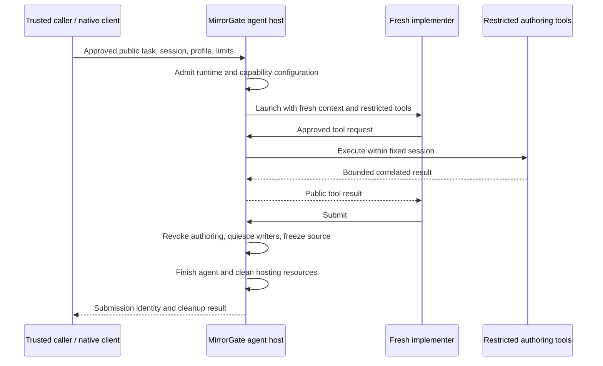

# MirrorGate-managed agent hosting

Status: accepted ownership direction, recorded 2026-09-09; implementation is
planned. MirrorGate does not currently expose a general agent-launch operation.
This document defines intended ownership and acceptance requirements. It does
not extend the frozen control v1 schema.

## Decision

MirrorGate will own the trusted agent host as an optional module alongside its
authoring, build, and execution supervision. It will launch and configure the
implementer, deliver approved public context, mediate tools, and manage the
agent through submission or failure and cleanup.

Today each caller must assemble agent configuration, tool restrictions, a broker,
prompt delivery, process management, and cleanup. These steps determine whether
an agent can bypass Gate's restrictions. One Gate-owned implementation makes
them reusable by clients in different languages and testable through a shared
interface.

Human authors and trusted external agent hosts can continue using restricted
authoring tools. External hosts retain responsibility for complete tool
mediation and context control; using a Gate tool alone does not establish those
properties for an otherwise unrestricted agent.

## Current implementation and migration source

Gate currently manages restricted authoring commands, source/artifact preparation,
execution workers, and cleanup. The [authoring-host example](../examples/authoring-host.py)
is a fixed-workspace tool gateway, not an AI launcher.

MirrorECMA's [blind Counter experiment](../../MirrorECMA/experiments/blind-counter/README.md)
contains the existing agent-hosting helpers:

| Helper | Responsibility to generalize into Gate |
| --- | --- |
| `author-host/prepare_author.py` | Fresh Codex configuration, restricted tool inventory, private authentication lifecycle |
| `author-host/run_author.py` | Agent process launch, prompt delivery, deadline, transcript, and cleanup |
| `author-host/mcp_gate.py` | Public contract, restricted execution, and submission tool transport |
| `author-host/audit_tools.py` | Actual tool-dispatch audit and rejection of non-Gate access |
| `evaluator.mjs` authoring broker | Bind requests to one session and coordinate submission |

These checked-in experiment helpers are migration evidence, not a supported
Gate hosting interface. Remove Counter-specific contracts, paths, and tool
assumptions when promoting them. Private replay, expected states, and verdict
policy stay with the evaluator. No helpers move as part of this documentation
change.

## Ownership and trust

| Owner | Responsibility |
| --- | --- |
| Trusted caller/evaluator | Select the task; approve public materials and feedback; retain private specifications, scenarios, and expected results |
| Operator | Approve installed agent profiles, tools, mounts, model access, credential references, and limit ceilings |
| MirrorGate agent host | Create fresh context, configure allowed capabilities, deliver approved inputs, route tools, and own run lifecycle and cleanup |
| MirrorGate supervisor/backend | Enforce restricted tool/build/worker execution and immutable handoffs |
| Agent runtime integration | Translate the hosting contract into runtime-specific configuration, invocation, events, and cancellation |
| Mirrors and native clients such as MirrorECMA | Retain model semantics, generated bindings, negotiation, replay, and comparison responsibilities |

The agent host remains trusted code within MirrorGate. The model/controller may
run outside the authoring sandbox; submitted commands run inside it. Model-service
authentication and approved model network access belong to the trusted hosting
path. They must not become capabilities of submitted commands. Hosting does not
enable external networking in the existing `linux-bubblewrap-v1` authoring profile.

Gate must prevent unrelated evaluator environment variables, handles, host
configuration, project instructions, conversation history, retrieval sources,
and credentials from entering a fresh run. Temporary model credentials stay
outside submission mounts and public logs and are removed during cleanup.
Detailed runtime diagnostics remain trusted unless approved for disclosure.

The evaluator decides what is public; Gate enforces delivery and tool access.
Gate cannot infer whether arbitrary task prose or a mounted file contains a
secret. A caller must not forward its private conversation as the author's
initial context. Hosting does not establish general noninterference or honest
observations by the submitted adapter.

## Intended interface

Expose one complete operation to run a fresh implementer in an existing,
unsealed authoring session. The trusted caller supplies:

- The session handle and an operator-approved agent profile identifier.
- An explicitly approved public task and public context bundle.
- Run limits within operator ceilings, including a wall-clock deadline and
  bounded tool output and event retention.

Gate resolves installed commands, model configuration, credentials, and tool
policy from trusted configuration. The implementer cannot select host paths,
mounts, executable overrides, control handles, or additional access tools.
The caller observes bounded progress, can cancel, and receives a terminal run
result with submission identity when applicable and cleanup status. An agent's
natural-language final response is not a submission or conformance verdict.

Native clients must invoke the same Gate-owned lifecycle through shared control.
They must not recreate launcher or broker logic in each language. Users should
not need a separate manually started agent-host daemon; use the existing
owned/attached Gate process pattern.

Specify exact operation names, schema fields, errors, numeric limits, capability
negotiation, and SDK signatures in a versioned control extension before coding.
Current control v1 rejects unknown operations: no agent-launch request is valid
today. Unsupported hosting capabilities must fail before allocating an agent.
Worker port RPC and the Mirrors model protocol retain their existing roles;
prompts, credentials, and hosting controls do not belong on worker RPC.

## Lifecycle and failure rules

The first hosting profile supports one fresh agent run per authoring session,
with at most one active authoring command. Resume, reconnect, follow-up messages,
agent delegation, and automatic retries are excluded pending explicit context,
ownership, and disclosure contracts.

This is the target hosting flow. Build, negotiation, execution, and private
evaluation retain their existing preparation/admission ordering. The versioned
extension must settle integration with `session.prepare` without permitting a
second preparation or a different source snapshot.

- Admit the supported runtime configuration and backend before work. Missing
  runtimes, failed capability checks, or unavailable isolation fail closed;
  never fall back to an unrestricted agent or tool subprocess.
- Bind agent, broker, requests, and events to the owning control connection and
  session. Other clients cannot inject prompts, invoke tools, submit, or adopt
  its handles.
- Disable or mediate native shell, file APIs, search, connectors, memory, hooks,
  and delegation. Verify actual dispatch and implicit context loading, not
  just prompt instructions or configuration flags.
- Submission irrevocably closes authoring admission. Settle or cancel active
  commands and stop managed writers before freezing. Trusted callers must
  exclude independent external writers. Reject late tools and preserve the
  frozen source through build/evaluation.
- Prose completion or exit before submission is a failure without a submitted
  result. Crashes, deadline expiry, cancellation, and owner disconnect revoke
  tools and trigger bounded cleanup; partial source is not auto-submitted.
- Submission/cancellation races have one authoritative terminal outcome that
  states whether submission committed. Never infer this from agent exit or
  retry an uncertain launch/submission mutation.
- Terminate owned agent/tool processes, close brokers and descriptors, remove
  temporary credential material, and record cleanup completion. Agent exit
  alone is insufficient. Attached-client cleanup cannot stop the shared daemon
  or another client's run. Abrupt Gate death leaves cleanup unconfirmed; this
  proposal does not add crash recovery.
- Distinguish agent completion, submission, build success, conformance verdict,
  and cleanup. Preserve the primary failure when cleanup also fails.

## Implementation sequence and acceptance

1. Specify the versioned control extension and operator catalog additions,
   including states, race ordering, numeric limits, diagnostics, and ownership.
2. Promote generic hosting/broker logic into Gate and implement the first Codex
   runtime integration with an explicit tested version contract. Keep its
   configuration details out of the shared session state machine.
3. Add native client entry points over the shared contract. Reduce MirrorECMA's
   experiment to supplying public inputs and running private evaluation.
4. Exercise the public hosting interface with the acceptance cases below.

| Case | Required evidence |
| --- | --- |
| Fresh author | Empty source and approved public contract produce a submission using managed tools, without inherited private conversation or host context |
| Capability denial | Actual dispatcher rejects alternative tools, resource discovery, credential reads, and escalation; approved Gate calls succeed |
| Backend enforcement | Author commands and submitted build hooks fail private filesystem/environment/descriptor/network probes under real Bubblewrap |
| Admission failure | Unsupported runtime/profile/capability allocates no author; backend launch failure starts no unrestricted command |
| Ownership | Foreign connection/session handles and tool requests change no other run |
| Sealing races | Submit, active commands, late writes, cancellation, and preparation produce a single outcome and immutable source identity |
| Failure cleanup | Crash, no-submit exit, timeout, disconnect, duplicate submission, and cleanup failure produce bounded explicit outcomes; successful cleanup leaves no owned resources |
| Disclosure | Prompts, author tools, and public events contain only approved material; private diagnostics and credentials stay trusted |
| Client independence | Two native clients exercise the same Gate lifecycle without separate launchers or transition functions |
| End-to-end evaluation | Fresh source passes restricted build and real private replay; a faulty submission is rejected and cleanup is recorded |

Retain existing worker/isolation gates and extend shared control fixtures and
required gates for hosting. Record supported agent/runtime versions separately
from worker runtimes, interface digests, and artifact identities. Until that
evidence exists, compatibility documentation must mark managed hosting planned.
