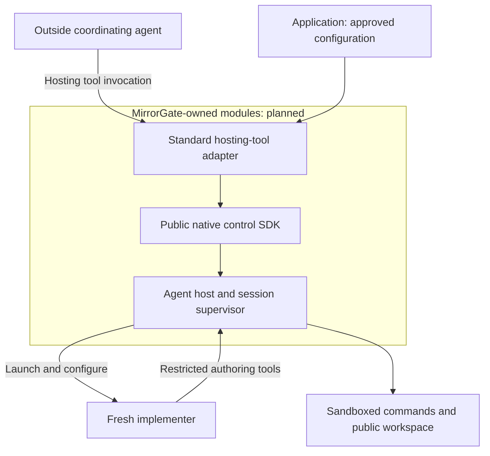
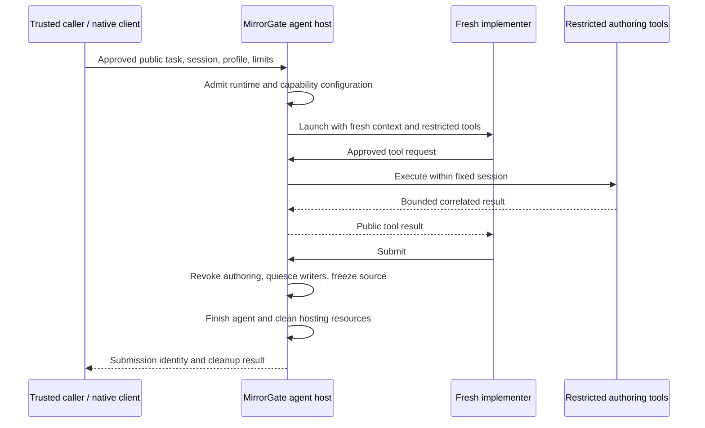

# MirrorGate-managed agent hosting

Status: accepted ownership direction, recorded 2026-09-09; implementation is
planned. MirrorGate does not currently expose a general agent-launch operation.
This document defines intended ownership and acceptance requirements. It does
not extend the frozen control v1 schema.

## Decision

MirrorGate will own the trusted agent host as an optional module alongside its
authoring, build, and execution supervision. It will launch and configure the
implementer, deliver approved public context, mediate tools, and manage the
agent through submission or failure and cleanup.

MirrorGate will also provide the standard hosting-tool adapter exposed to an
outside coordinating agent. Applications configure and register this supplied
adapter; they do not have to implement the wrapper between their agent framework
and Gate's hosting operation. The adapter, native SDK, and hosting supervisor
are all MirrorGate-owned. The surrounding agent framework and application remain
external integrations.

Today each caller must assemble agent configuration, tool restrictions, a broker,
prompt delivery, process management, and cleanup. These steps determine whether
an agent can bypass Gate's restrictions. One Gate-owned implementation makes
them reusable by clients in different languages and testable through a shared
interface.

Human authors and trusted external agent hosts can continue using restricted
authoring tools. External hosts retain responsibility for complete tool
mediation and context control; using a Gate tool alone does not establish those
properties for an otherwise unrestricted agent.

## Primary coordinator-driven workflow

The user starts the coordinating coding agent and works with it on behavior
and invariant specifications. Model checking checks invariants against behavior
under the selected configuration. The model-interface compiler supplies a typed
port and trusted binding, not the SUT or implementation-specific adapter.

The coordinator requests authoring directly through MirrorGate's hosting
tool/SDK, providing the approved brief, public port declarations/files, and a
permitted profile. Gate launches a fresh implementer, mediates restricted tools,
and accepts submission. The coordinator remains user-started and outside Gate
ownership. MirrorECMA does not transport prompts or start/attach Gate.

Gate freezes source, runs restricted build/preparation, and freezes the artifact.
A separate trusted evaluation integration under `integrations/mirrorecma/`
connects Gate's implementation proxy to MirrorECMA's generic negotiated MBT
interfaces. It retains the owning Gate connection and uses successful required
model matching before authorizing/acquiring an evaluation worker. MirrorECMA
replays against the supplied implementation; Mirrors compares observations.
Gate owns physical worker/resource cleanup, and the integration awaits it.

The dependency direction is integration -> Gate public SDK and MirrorECMA public
MBT API. Gate's core remains independent of MirrorECMA, and MirrorECMA's target
core has no Gate policy, agent, artifact, or process-lifecycle concepts. Reuse
existing implementation factories/bindings; any needed generic extension must
work for local and external implementations without naming Gate.

Full model-facing bindings and private specifications stay in trusted evaluation.
Approved public requirements must still be sufficient for the implementer to
know what to build. The standard hosting-tool adapter is the primary agent-facing
entry point; trusted automation may instead call Gate's native SDK directly.
Neither route passes authoring inputs through MirrorECMA.

See [MirrorECMA's implementation boundary](../../MirrorECMA/docs/implementation-boundary-design.md)
for existing-facade migration and generic binding requirements. Apalache is the
integrated Mirrors backend; TLC can be a separate model-checking step, with no
automated TLC integration claimed here. Existing Gate-aware `evaluateSandboxed`
code is current functionality awaiting extraction, not proof of this target.

## Current implementation and migration source

Gate currently manages restricted authoring commands, source/artifact preparation,
execution workers, and cleanup. The [authoring-host example](../examples/authoring-host.py)
is a fixed-workspace tool gateway, not an AI launcher.

MirrorECMA's [blind Counter experiment](../../MirrorECMA/experiments/blind-counter/README.md)
contains the existing agent-hosting helpers:

| Helper | Responsibility to generalize into Gate |
| --- | --- |
| `author-host/prepare_author.py` | Fresh Codex configuration, restricted tool inventory, private authentication lifecycle |
| `author-host/run_author.py` | Agent process launch, prompt delivery, deadline, transcript, and cleanup |
| `author-host/mcp_gate.py` | Public contract, restricted execution, and submission tool transport |
| `author-host/audit_tools.py` | Actual tool-dispatch audit and rejection of non-Gate access |
| `evaluator.mjs` authoring broker | Bind requests to one session and coordinate submission |

These checked-in experiment helpers are migration evidence, not a supported
Gate hosting interface. Remove Counter-specific contracts, paths, and tool
assumptions when promoting them. Private replay, expected states, and verdict
policy stay with the evaluator. No helpers move as part of this documentation
change.

## Ownership and trust

| Owner | Responsibility |
| --- | --- |
| Trusted caller/evaluator | Select the task; approve public materials and feedback; retain private specifications, scenarios, and expected results |
| Operator | Approve installed agent profiles, tools, mounts, model access, credential references, and limit ceilings |
| MirrorGate agent host | Create fresh context, configure allowed capabilities, deliver approved inputs, route tools, and own run lifecycle and cleanup |
| MirrorGate hosting-tool adapter | Expose the approved hosting operation to an outside agent, validate tool inputs, bind requests to trusted session/task configuration, and project allowed progress/results |
| Application integration | Register/configure the coordinator's Gate tools and approve task/profile bindings |
| Separate trusted evaluation integration | Compose public Gate SDK and generic MirrorECMA MBT interfaces, retain owner connection, supply the implementation proxy, and await cleanup |
| MirrorGate supervisor/backend | Enforce restricted tool/build/worker execution and immutable handoffs |
| Agent runtime integration | Translate the hosting contract into runtime-specific configuration, invocation, events, and cancellation |
| Mirrors | Resolve model interfaces and compare reported observations with model states |
| MirrorECMA and other MBT clients | Test caller-supplied implementations through generic negotiation, generated bindings, replay, reports, and disposal; no agent hosting or Gate orchestration in the target core |

The agent host remains trusted code within MirrorGate. The model/controller may
run outside the authoring sandbox; submitted commands run inside it. Model-service
authentication and approved model network access belong to the trusted hosting
path. They must not become capabilities of submitted commands. Hosting does not
enable external networking in the existing `linux-bubblewrap-v1` authoring profile.

Gate must prevent unrelated evaluator environment variables, handles, host
configuration, project instructions, conversation history, retrieval sources,
and credentials from entering a fresh run. Temporary model credentials stay
outside submission mounts and public logs and are removed during cleanup.
Detailed runtime diagnostics remain trusted unless approved for disclosure.

The evaluator decides what is public; Gate enforces delivery and tool access.
Gate cannot infer whether arbitrary task prose or a mounted file contains a
secret. A caller must not forward its private conversation as the author's
initial context. Hosting does not establish general noninterference or honest
observations by the submitted adapter.

## Intended interface

Expose one complete operation to run a fresh implementer in an existing,
unsealed authoring session. The trusted caller supplies:

- The session handle and an operator-approved agent profile identifier.
- An explicitly approved public task and public context bundle, supplied inline
  by the trusted native caller. Constructing this declared public input is the
  caller's disclosure decision; no separate manual approval step is implied.
- Run limits within operator ceilings, including a wall-clock deadline and
  bounded tool output and event retention.

Gate resolves installed commands, model configuration, credentials, and tool
policy from trusted configuration. The implementer cannot select host paths,
mounts, executable overrides, control handles, or additional access tools.
The caller observes bounded progress, can cancel, and receives a terminal run
result with submission identity when applicable and cleanup status. An agent's
natural-language final response is not a submission or conformance verdict.

Gate tools, native Gate SDK clients, and external evaluation integrations invoke
the same Gate-owned lifecycle through shared control. They must not recreate
launcher/broker logic. MirrorECMA is not one of these hosting clients in the
target architecture. Users need no separate manually operated agent-host daemon;
the trusted Gate tool host/integration uses owned or attached Gate control.

Specify exact operation names, schema fields, errors, numeric limits, capability
negotiation, and SDK signatures in a versioned control extension before coding.
Current control v1 rejects unknown operations: no agent-launch request is valid
today. Unsupported hosting capabilities must fail before allocating an agent.
Worker port RPC and the Mirrors model protocol retain their existing roles;
prompts, credentials, and hosting controls do not belong on worker RPC.

## Standard hosting-tool adapter

This adapter is part of MirrorGate's planned distribution. It serves the outside
coordinating agent; the implementer's restricted contract/exec/submit tools are
a separate surface. The implementer must not receive the outside hosting tool,
since delegation is excluded from the first managed profile.

The first intended standard transport is a stdio MCP adapter over a public Gate
SDK. MCP registration is application configuration; the adapter's process,
definitions, handlers, and validation are shipped by MirrorGate. Native callers
may use Gate's SDK directly. No separate manually operated hosting daemon or
MirrorECMA-specific orchestrator is required. Exact tool names, schemas, package
entry points, and transport requirements remain AH1/AH11 work; there is no
implemented hosting MCP server or launch command today.

The adapter must provide these operations, with final wire names fixed by AH1:

| Tool operation | Inputs exposed to the outside agent | Allowed result |
| --- | --- | --- |
| Start implementation | An approved task reference and only explicitly permitted choices within its configured profile/limits | A caller-scoped run reference and acceptance status |
| Inspect implementation | That caller's run reference and bounded progress selection | Approved progress and terminal submission/cleanup outcome when available |
| Cancel implementation | That caller's run reference | Cancellation status and the authoritative terminal outcome once settled |

Trusted configuration binds the approved task/public bundle, profile, limits,
session, model access, and result-disclosure policy before requests are accepted.
The standard agent-facing adapter uses approved task references, while trusted
automation can submit declared public inputs through Gate's native SDK. Neither
path routes the brief through MirrorECMA. Merely accepting arbitrary
prompt text from an outside agent does not constitute disclosure approval.
Applications may prepare approved tasks programmatically without writing a
custom hosting wrapper. Any later free-form task mode needs an explicit trusted
approval policy and a corresponding contract.

The adapter owns argument validation and transport mapping; Gate's controller
remains authoritative for admission, session state, submission, and cleanup.
Never expose policy files, credentials, executable overrides, mounts, or raw
administrative session/control handles in agent-facing schemas or results.
Public run references must be bound to the caller and owning session and must
not grant access to another caller's run or private evaluator diagnostics.
Status/discovery/error paths obey the same disclosure rules as successful calls.

Keep the owning Gate connection alive across start/status/cancel tool calls and
through the required submission handoff. An individual tool reply does not close
the session. The separate trusted evaluation integration must use that owner's
Gate connection; MirrorECMA receives only its implementation binding. The adapter
must not invent cross-connection handle adoption or reconnect support. AH1 must
define the supported embedding/handoff between the stdio adapter and integration. Owner loss revokes tools and invokes
bounded Gate cleanup; it cannot silently orphan an agent or frozen source.

Unsupported server/runtime capabilities fail before launch. Duplicate requests,
lost replies, cancellation, output bounds, and terminal correlation must follow
the shared control contract. A tool timeout is not proof of cancellation; query
or cancel through the retained owning connection, without retrying an uncertain
launch. Hosting-tool transport must not add a second process launcher, state
machine, source-freezing path, or evaluator.

## Lifecycle and failure rules

The first hosting profile supports one fresh agent run per authoring session,
with at most one active authoring command. Resume, reconnect, follow-up messages,
agent delegation, and automatic retries are excluded pending explicit context,
ownership, and disclosure contracts.

This is the target hosting flow. Build, negotiation, execution, and private
evaluation retain their existing preparation/admission ordering. The versioned
extension must settle integration with `session.prepare` without permitting a
second preparation or a different source snapshot.

- Admit the supported runtime configuration and backend before work. Missing
  runtimes, failed capability checks, or unavailable isolation fail closed;
  never fall back to an unrestricted agent or tool subprocess.
- Bind agent, broker, requests, and events to the owning control connection and
  session. Other clients cannot inject prompts, invoke tools, submit, or adopt
  its handles.
- Disable or mediate native shell, file APIs, search, connectors, memory, hooks,
  and delegation. Verify actual dispatch and implicit context loading, not
  just prompt instructions or configuration flags.
- Submission irrevocably closes authoring admission. Settle or cancel active
  commands and stop managed writers before freezing. Trusted callers must
  exclude independent external writers. Reject late tools and preserve the
  frozen source through build/evaluation.
- Prose completion or exit before submission is a failure without a submitted
  result. Crashes, deadline expiry, cancellation, and owner disconnect revoke
  tools and trigger bounded cleanup; partial source is not auto-submitted.
- Submission/cancellation races have one authoritative terminal outcome that
  states whether submission committed. Never infer this from agent exit or
  retry an uncertain launch/submission mutation.
- Terminate owned agent/tool processes, close brokers and descriptors, remove
  temporary credential material, and record cleanup completion. Agent exit
  alone is insufficient. Attached-client cleanup cannot stop the shared daemon
  or another client's run. Abrupt Gate death leaves cleanup unconfirmed; this
  proposal does not add crash recovery.
- Distinguish agent completion, submission, build success, conformance verdict,
  and cleanup. Preserve the primary failure when cleanup also fails.

## Reusable MBT harness and optional evaluation service

After hosting, the resulting implementation can be evaluated by a source-code
test or by a service handler invoking the same trusted suite module. The
[evaluation-service proxy](evaluation-service-design.md) requests a complete MBT
run; it is distinct from the implementation proxy that invokes SUT operations
and from the hosting tool that launches the implementer.

The service lives in the optional external integration, preserves generic
MirrorECMA semantics, and resolves approved suite/implementation references
without exposing private tests or Gate handles. It retains the owning Gate
connection through evaluation and cleanup. Keeping test files beside source
does not permit mounting private tests or accepting a submitted replacement
of the evaluator's suite. Source-test support does not depend on service delivery.

## Implementation sequence and acceptance

The [implementation task ledger](agent-hosting-tasks.md) assigns this work to
`specification_implementer`, with contract prerequisites, path ownership,
dependency ordering, and separate planning/implementation evidence.

The [AH1.1 contract decisions](agent-hosting-contract-decisions.md) are the
reviewed input for the versioned schema/fixture freeze, not an implemented
protocol. Detailed dispatch packages and actual assignment results are recorded
in the task ledger.

1. Specify the versioned control extension and operator catalog additions,
   including states, race ordering, numeric limits, diagnostics, and ownership.
2. Promote generic hosting/broker logic into Gate and implement the first Codex
   runtime integration with an explicit tested version contract. Keep its
   configuration details out of the shared session state machine.
3. Add native Gate SDK entry points and the coordinator's standard hosting tool.
   Extract Gate-aware evaluation composition into an external integration that
   supplies implementation bindings to MirrorECMA's generic MBT API. Migrate
   existing coupled consumers without adding a managed-author option to MirrorECMA.
4. Exercise the public hosting interface with the acceptance cases below.

| Case | Required evidence |
| --- | --- |
| Fresh author | The coordinator requests a fresh restricted implementer directly from Gate; public inputs and hosting control never pass through MirrorECMA |
| Capability denial | Actual dispatcher rejects alternative tools, resource discovery, credential reads, and escalation; approved Gate calls succeed |
| Backend enforcement | Author commands and submitted build hooks fail private filesystem/environment/descriptor/network probes under real Bubblewrap |
| Admission failure | Unsupported runtime/profile/capability allocates no author; backend launch failure starts no unrestricted command |
| Ownership | Foreign connection/session handles and tool requests change no other run |
| Sealing races | Submit, active commands, late writes, cancellation, and preparation produce a single outcome and immutable source identity |
| Failure cleanup | Crash, no-submit exit, timeout, disconnect, duplicate submission, and cleanup failure produce bounded explicit outcomes; successful cleanup leaves no owned resources |
| Disclosure | Prompts, author tools, and public events contain only approved material; private diagnostics and credentials stay trusted |
| Client independence | Two native Gate SDK clients exercise one shared lifecycle without duplicate launchers or a required MirrorECMA orchestrator |
| MBT decoupling | MirrorECMA core imports/replays with Gate absent; local and external proxy implementations use the same generic MBT interface |
| Standard hosting tool | An outside agent starts, inspects, and cancels through the shipped adapter using configuration alone; actual dispatch rejects task/profile escalation, foreign run references, leaked control handles, and private diagnostics |
| End-to-end evaluation | Fresh source passes restricted build and real private replay; a faulty submission is rejected and cleanup is recorded |

Retain existing worker/isolation gates and extend shared control fixtures and
required gates for hosting. Record supported agent/runtime versions separately
from worker runtimes, interface digests, and artifact identities. Until that
evidence exists, compatibility documentation must mark managed hosting planned.
