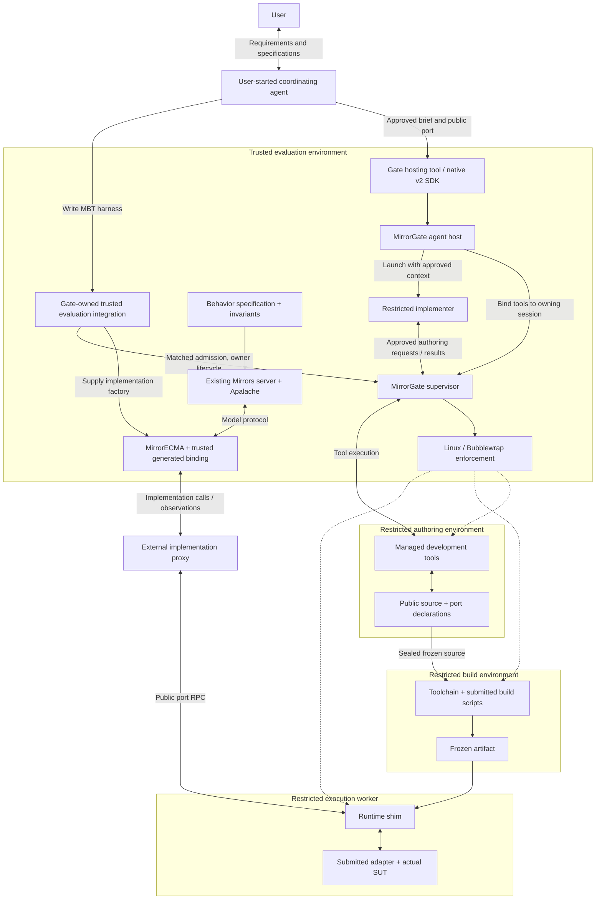

# MirrorGate architecture

Status: destination-integrated Linux profile with managed hosting and external
MBT integration, 2026-09-09; coordinated local gates passed. The
[backend guide](linux-bubblewrap.md) and [hosting ledger](agent-hosting-tasks.md)
identify tested restrictions and remaining acceptance. Broader platform/release
guarantees remain outside this local evidence. Exact results are maintained in
the [validation report](managed-workflow-validation.md).

The [managed agent host](agent-hosting-design.md) and standard outside-agent
hosting tool are MirrorGate-owned implementations. Applications configure/register
the supplied adapter or call the native v2 SDK. Actual Codex authoring passed
through the SDK and installed MCP protocol harness. A real outside Codex
coordinator also registered the installed adapter and completed the real
implementer/MBT/cleanup workflow. Synthetic fixtures, protocol-harness evidence
and actual-framework acceptance remain separately identified.

MirrorGate is intended to manage access boundaries throughout authoring,
building, and evaluating an application's adapter and system under test (SUT).
It keeps the implementer's tools and submitted code separate from the private
validation oracle, while providing a shared interface for isolated execution.

MirrorGate owns all three parts of the managed workflow: agent hosting,
sandbox/artifact lifecycle, and trusted evaluation integration. The latter
is outside MirrorECMA core but inside MirrorGate's product ownership. See the
[R1–R3 responsibility contract](managed-workflow-design.md).

## Primary user workflow

The user starts the coordinating agent, develops behavior/invariant specifications,
and checks the models. That agent requests restricted implementation directly
through Gate's hosting interface, supplying only an approved brief and public
compiler-generated port declarations. Gate creates the implementer and manages
authoring, source/build/artifact freezing, restricted execution, and cleanup.

The coordinator also writes the MBT harness. Gate's trusted evaluation integration
supplies the generated binding over a Gate worker proxy to MirrorECMA's ordinary
MBT interface and connects to the existing Mirrors server. This integration owns
the Gate connection and authorization/cleanup composition. MirrorECMA itself
does not launch agents, accept prompts, build artifacts, or manage Gate.

This [implementation boundary](https://github.com/NzSN/MirrorECMA/blob/main/docs/implementation-boundary-design.md)
is implemented by the external `mirrorgate-mirrorecma` package and coordinated
MirrorECMA 2 cutover. New consumers use `evaluateImplementation` or the prepared
provider; the extracted facade remains in the package's `/legacy` entry point.
The Gate-owned hosting tool is the primary agent-facing route, with direct
native SDK automation also available. Destination verification and the
coordinated model/client gates are recorded in the validation report.

## Ownership

| Owner | Responsibilities |
| --- | --- |
| Mirrors | Resolve model interfaces, emit bindings, invoke Apalache, and compare reported observations with model states |
| Trusted evaluator/caller | Own private specifications, validation configuration, selected scenarios, expected results, task selection, and approval of public context and feedback |
| MirrorGate | Manage authoring, build, and execution sandboxes, tools, worker RPC, runtime shims, and conformance; agent host owns implementer launch, configuration, context delivery, and cleanup |
| Isolation backend | Enforce the configured filesystem, process, privilege, network, and resource restrictions through OS, container, or VM mechanisms |
| Trusted agent host (MirrorGate module) | Launch/configure the implementer, route access-capable tools through MirrorGate, deliver approved public context, and manage agent lifecycle |
| Hosting-tool adapter (MirrorGate module) | Expose restricted start/status/cancel operations to the outside agent through the public Gate SDK; validate approved task bindings and project allowed results |
| Application integration | Register/configure Gate's agent-facing tools and approve public inputs |
| MirrorGate-owned trusted evaluation integration | Supply the implementation factory/proxy, bridge negotiated admission, retain ownership, await cleanup, and aggregate evaluation/cleanup evidence |
| MirrorECMA | Generic MBT against caller-supplied implementations; Gate-aware orchestration resides in the external Gate package |
| Application implementer | Write the actual SUT and adapter through the public authoring environment, then submit a fixed artifact for evaluation |

The complete specification may contain public interface information as well as
private invariants and transition logic. The evaluator exports the public
contract needed by the implementer; it retains the private validation material.

MirrorECMA provides generic MBT and binding execution. A supported Gate-owned
integration composes it with the implementation proxy and owns the local workflow. Trust belongs to the
evaluator code/configuration and its execution environment, not to a library name.
Gate's core does not depend on MirrorECMA; the optional integration uses only
public interfaces from both libraries.

## Access boundary ownership

MirrorGate owns the policy and lifecycle layer for all three sandbox profiles.
The isolation backend supplies actual access enforcement; the evaluator owns
the private data and decides what information may be disclosed.

| Profile | Permitted work and resources | Controlled handoff |
| --- | --- | --- |
| Authoring | Public contract, SUT/adapter source, approved development tools and public tests | Snapshot the submitted source without a live writable link to evaluation |
| Build | Submitted source, approved dependencies/toolchain, and build scripts; no evaluator secrets | Record and freeze the built artifact and dependency identities |
| Execution | Frozen artifact, permitted port inputs, writable SUT resources, and approved test services | Return actual observations; keep private evaluation reports with the evaluator |

The implementer is the human or coding agent that writes the code. The
restricted execution worker runs the submitted adapter and SUT; it does not
host an authoring agent that can change the submission between private cases.
An authoring agent may have broad development capabilities within its own
profile without gaining access to the evaluation environment.

The MirrorGate-owned trusted agent host routes the coding agent's filesystem operations,
shell commands, search, builds, and other resource-access tools through
MirrorGate-managed execution or an explicitly approved restricted integration.
The agent must not retain an unrestricted host tool or connector that can read
private evaluator resources. Such a route bypasses MirrorGate and invalidates
the corresponding blindness claim; merely placing the workspace in another
directory or repository does not close it.

Private specifications, credentials, expected states, and hidden diagnostics
must also be excluded from the agent's prompts, retrieved context, and tool
responses. The evaluator approves disclosure; the agent host enforces delivery
and capability restrictions. A sandbox
cannot conceal information already supplied through an allowed channel.

MirrorGate accepts policy from trusted configuration. Submitted artifacts and
tool requests cannot grant themselves additional mounts, privileges, secrets,
network access, or access to sandbox-management interfaces. An environment
whose backend cannot enforce the requested profile must fail admission. A weaker
development profile must be selected explicitly and cannot claim the stronger
profile's blindness guarantee.

## Authoring, build, and evaluation flow

The coding model or agent controller may be hosted elsewhere; the authoring
profile governs its accessible resources and tool execution, not the physical
location of model inference. Its host exposes the managed tool gateway without
an independent path to evaluator resources.

The agent-host node is implemented by Gate's audited runtime adapter. Its trusted
process and model credentials remain outside the writable authoring environment.
Native clients request hosting through [shared control v2](agent-hosting-control-v2.md)
without implementing their own launchers. External hosts and human authoring
remain optional integrations with their own tool/context obligations. See the
[hosting lifecycle](agent-hosting-design.md#lifecycle-and-failure-rules).

For direct tool invocation by the outside coordinating agent, MirrorGate supplies the
[standard hosting-tool adapter](agent-hosting-design.md#standard-hosting-tool-adapter).
The application registers it and configures approved tasks and profiles. Its
start/status/cancel tools are distinct from the implementer's restricted
authoring tools; supplying the hosting tool to the implementer would enable
delegation outside the initial profile.

Solid arrows show information or control handoffs; dashed arrows show backend
enforcement. The supervisor creates, limits, terminates, and cleans up the
environments through that backend. The evaluator owns semantic validation.
Worker messages may travel over a channel supplied by the supervisor. The
authoring source is not mounted live into an active private evaluation.

## Harness reuse and evaluation-service access

The trusted MBT harness can be a reusable source module called by a test file,
CLI, or optional evaluation service. The supported local workflow and optional
service wrapper both belong to Gate's trusted evaluation integration; suites
and disclosure policy belong to the evaluator.
MirrorECMA still receives a generic implementation factory/binding. The optional
service implements [authenticated loopback HTTP v1](evaluation-service-contract-v1.md)
over that same workflow; remote HTTP/TLS deployment is not implemented.

An implementation proxy carries public operations between the generated binding
and the SUT. An evaluation-service proxy lets an outside caller start/query/cancel
an entire MBT run. They are separate interfaces and may be composed. Service
RPC does not extend Gate control v1, worker RPC, or the Mirrors model protocol.
See the [evaluation-service design](evaluation-service-design.md) and
[harness/source-test design](https://github.com/NzSN/MirrorECMA/blob/main/docs/mbt-harness-design.md).

## The public port is the RPC seam

The evaluator keeps the generated binding and model-facing replay logic. It
decodes model stimuli into declared inputs, calls a proxy implementing the
generated port, and encodes the returned observations for Mirrors.

The proxy sends public operations such as initialization, a typed action, or
observation. It never forwards an entire `StateComputer`/`ReplayComputer` call:
those interfaces can include the initial expected model state and previous
reported state. Filtering must happen before the worker channel.

Expected states, specification paths, invariant choices, private traces, raw
Mirror messages, and evaluator credentials remain in the trusted environment.
The worker receives only information permitted by its public port contract.

## Shared infrastructure and language-specific code

| Mechanism | Ownership |
| --- | --- |
| Authoring/build/execution policy, tool mediation, resources, process cleanup | Shared supervisor with isolation backend |
| Framing, correlation, lifecycle, cancellation/error semantics | Shared protocol |
| Stable IDs, value semantics, compatibility fixtures | Shared contracts and conformance suite |
| Loading the approved submission entry point and invoking native methods | Runtime-specific shim |
| Native representation conversion | Runtime-specific or generated codecs |
| Mapping model operations to real application behavior | Application adapter |

Node, C++, Rust, and Lean workers can implement the same protocol without
sharing a binary ABI. A worker does not need to run its language's complete
Mirrors client. A single trusted MirrorECMA driver could therefore evaluate
submissions in all these languages; other evaluators can integrate later.

The supervisor chooses trusted profiles for the three stages. Profiles may
have different dependencies and resource limits while sharing policy mechanisms.
The worker RPC is the execution-stage interface; it does not replace the
authoring tool gateway or authorize submission build scripts to run in the
trusted evaluator.

## Evidence required for an access-boundary claim

Verify each supported profile in the actual backend. Authoring tests must
attempt private-resource access through every exposed class of tool. Build
tests must exercise submission-controlled hooks. Execution tests must attempt
access through the running adapter, including filesystem, process, network,
credential, and management-interface routes denied by its policy.

Also verify that rejected tool requests cannot relax the policy, that private
context is not included in returned tool results, and that source edits after
submission cannot change the frozen artifact being evaluated. Record cleanup,
resource-limit, backend, and platform evidence separately.

These checks establish the tested access restrictions. They do not prove that
an observer reads the actual SUT rather than fabricating an answer, or that
permitted stimuli and verdicts reveal no information. Observation fidelity and
result disclosure remain separate obligations, as described in
[blind validation](blind-validation.md).

## Repository and dependency boundaries

The repository areas are `protocol/`, `supervisor/`, `runtimes/`, `sdk/`,
`integrations/`, `conformance/`, and `docs/`. Python supervision and Node/Rust runtime shims are
implemented; other language workers and backends remain extensions.

Mirrors remains authoritative for model-interface resolution and generation.
MirrorGate consumes versioned public artifacts and provides SDK/protocol
interfaces for generated code to target. It does not duplicate the resolver or
depend on MirrorECMA's private modules. Gate-owned integrations depend on public
MirrorGate and MirrorECMA interfaces through explicit compatible versions.
The coordinated MirrorECMA 2 core does not depend on Gate's SDK or lifecycle;
its removed sandbox exports are available through the external package's
compatibility entry point. The task ledger links completed destination/core
cutover evidence and completed actual-framework acceptance.

Protocol compatibility, runtime profile identity, and semantic interface
identity are distinct. See [worker protocol](worker-protocol.md). The private
validation specification requires its own revision record; an interface digest
does not identify the hidden invariants used for evaluation.

Related: [isolation](blind-validation.md), [implementation plan](implementation-plan.md),
and the existing
[Mirrors generated-interface contract](https://github.com/NzSN/Mirrors/blob/main/Docs/generated-model-interface-spec.md).
