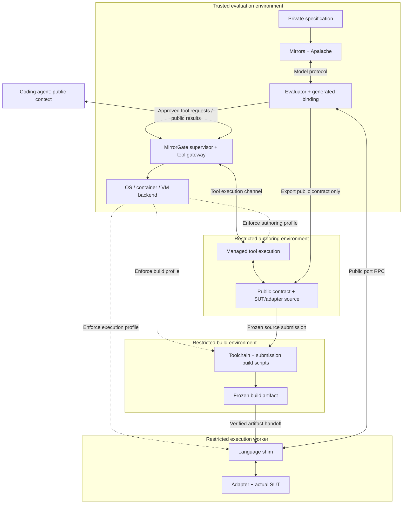

# MirrorGate architecture

Status: reference architecture with an initial Linux implementation. The
[backend guide](linux-bubblewrap.md) and [task evidence](tasks.md) identify the
implemented restrictions and limitations; broader platform guarantees remain
requirements rather than verified claims.

MirrorGate is intended to manage access boundaries throughout authoring,
building, and evaluating an application's adapter and system under test (SUT).
It keeps the implementer's tools and submitted code separate from the private
validation oracle, while providing a shared interface for isolated execution.

## Ownership

| Owner | Responsibilities |
| --- | --- |
| Mirrors | Resolve model interfaces, emit bindings, invoke Apalache, and compare reported observations with model states |
| Trusted evaluator | Own private specifications, validation configuration, selected scenarios, expected results, and disclosure policy |
| MirrorGate | Manage authoring, build, and execution sandbox profiles; mediate approved tool execution; define worker RPC; own sandbox lifecycle, runtime shims, and conformance tests |
| Isolation backend | Enforce the configured filesystem, process, privilege, network, and resource restrictions through OS, container, or VM mechanisms |
| Trusted agent host | Route access-capable agent tools through MirrorGate; expose only approved capabilities and public context to the implementation agent |
| Application implementer | Write the actual SUT and adapter through the public authoring environment, then submit a fixed artifact for evaluation |

The complete specification may contain public interface information as well as
private invariants and transition logic. The evaluator exports the public
contract needed by the implementer; it retains the private validation material.

MirrorECMA can initially provide the trusted evaluator's client and binding
driver. Its library name does not establish trust: the evaluator's code,
configuration, and execution environment must remain under trusted control.

## Access boundary ownership

MirrorGate owns the policy and lifecycle layer for all three sandbox profiles.
The isolation backend supplies actual access enforcement; the evaluator owns
the private data and decides what information may be disclosed.

| Profile | Permitted work and resources | Controlled handoff |
| --- | --- | --- |
| Authoring | Public contract, SUT/adapter source, approved development tools and public tests | Snapshot the submitted source without a live writable link to evaluation |
| Build | Submitted source, approved dependencies/toolchain, and build scripts; no evaluator secrets | Record and freeze the built artifact and dependency identities |
| Execution | Frozen artifact, permitted port inputs, writable SUT resources, and approved test services | Return actual observations; keep private evaluation reports with the evaluator |

The implementer is the human or coding agent that writes the code. The
restricted execution worker runs the submitted adapter and SUT; it does not
host an authoring agent that can change the submission between private cases.
An authoring agent may have broad development capabilities within its own
profile without gaining access to the evaluation environment.

The trusted agent host must route the coding agent's filesystem operations,
shell commands, search, builds, and other resource-access tools through
MirrorGate-managed execution or an explicitly approved restricted integration.
The agent must not retain an unrestricted host tool or connector that can read
private evaluator resources. Such a route bypasses MirrorGate and invalidates
the corresponding blindness claim; merely placing the workspace in another
directory or repository does not close it.

Private specifications, credentials, expected states, and hidden diagnostics
must also be excluded from the agent's prompts, retrieved context, and tool
responses. The evaluator and agent host own this disclosure control. A sandbox
cannot conceal information already supplied through an allowed channel.

MirrorGate accepts policy from trusted configuration. Submitted artifacts and
tool requests cannot grant themselves additional mounts, privileges, secrets,
network access, or access to sandbox-management interfaces. An environment
whose backend cannot enforce the requested profile must fail admission. A weaker
development profile must be selected explicitly and cannot claim the stronger
profile's blindness guarantee.

## Authoring, build, and evaluation flow

The coding model or agent controller may be hosted elsewhere; the authoring
profile governs its accessible resources and tool execution, not the physical
location of model inference. Its host exposes the managed tool gateway without
an independent path to evaluator resources.

Solid arrows show information or control handoffs; dashed arrows show backend
enforcement. The supervisor creates, limits, terminates, and cleans up the
environments through that backend. The evaluator owns semantic validation.
Worker messages may travel over a channel supplied by the supervisor. The
authoring source is not mounted live into an active private evaluation.

## The public port is the RPC seam

The evaluator keeps the generated binding and model-facing replay logic. It
decodes model stimuli into declared inputs, calls a proxy implementing the
generated port, and encodes the returned observations for Mirrors.

The proxy sends public operations such as initialization, a typed action, or
observation. It never forwards an entire `StateComputer`/`ReplayComputer` call:
those interfaces can include the initial expected model state and previous
reported state. Filtering must happen before the worker channel.

Expected states, specification paths, invariant choices, private traces, raw
Mirror messages, and evaluator credentials remain in the trusted environment.
The worker receives only information permitted by its public port contract.

## Shared infrastructure and language-specific code

| Mechanism | Ownership |
| --- | --- |
| Authoring/build/execution policy, tool mediation, resources, process cleanup | Shared supervisor with isolation backend |
| Framing, correlation, lifecycle, cancellation/error semantics | Shared protocol |
| Stable IDs, value semantics, compatibility fixtures | Shared contracts and conformance suite |
| Loading the approved submission entry point and invoking native methods | Runtime-specific shim |
| Native representation conversion | Runtime-specific or generated codecs |
| Mapping model operations to real application behavior | Application adapter |

Node, C++, Rust, and Lean workers can implement the same protocol without
sharing a binary ABI. A worker does not need to run its language's complete
Mirrors client. A single trusted MirrorECMA driver could therefore evaluate
submissions in all these languages; other evaluators can integrate later.

The supervisor chooses trusted profiles for the three stages. Profiles may
have different dependencies and resource limits while sharing policy mechanisms.
The worker RPC is the execution-stage interface; it does not replace the
authoring tool gateway or authorize submission build scripts to run in the
trusted evaluator.

## Evidence required for an access-boundary claim

Verify each supported profile in the actual backend. Authoring tests must
attempt private-resource access through every exposed class of tool. Build
tests must exercise submission-controlled hooks. Execution tests must attempt
access through the running adapter, including filesystem, process, network,
credential, and management-interface routes denied by its policy.

Also verify that rejected tool requests cannot relax the policy, that private
context is not included in returned tool results, and that source edits after
submission cannot change the frozen artifact being evaluated. Record cleanup,
resource-limit, backend, and platform evidence separately.

These checks establish the tested access restrictions. They do not prove that
an observer reads the actual SUT rather than fabricating an answer, or that
permitted stimuli and verdicts reveal no information. Observation fidelity and
result disclosure remain separate obligations, as described in
[blind validation](blind-validation.md).

## Repository and dependency boundaries

The intended repository areas are `protocol/`, `supervisor/`, `runtimes/`,
`conformance/`, and `docs/`. Python supervision and Node/Rust runtime shims are
implemented; other language workers and backends remain extensions.

Mirrors remains authoritative for model-interface resolution and generation.
MirrorGate consumes versioned public artifacts and provides SDK/protocol
interfaces for generated code to target. It does not duplicate the resolver or
depend on MirrorECMA's private modules. Clients depend on released MirrorGate
interfaces through explicit compatible versions.

Protocol compatibility, runtime profile identity, and semantic interface
identity are distinct. See [worker protocol](worker-protocol.md). The private
validation specification requires its own revision record; an interface digest
does not identify the hidden invariants used for evaluation.

Related: [isolation](blind-validation.md), [implementation plan](implementation-plan.md),
and the existing
[Mirrors generated-interface contract](https://github.com/NzSN/Mirrors/blob/main/Docs/generated-model-interface-spec.md).
