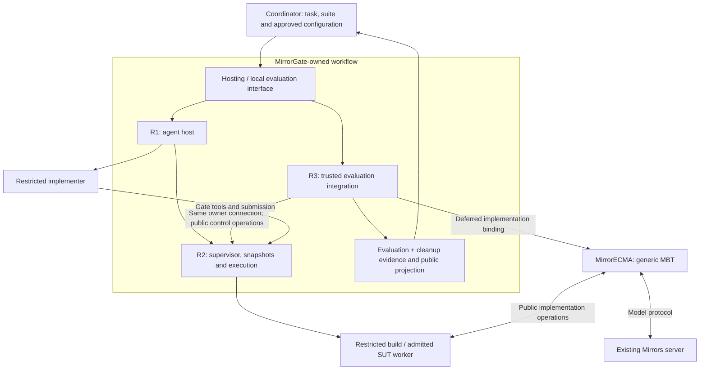

# MirrorGate-owned authoring and evaluation workflow

Status: destination integration and coordinated local gates passed, 2026-09-09.
Actual Codex authoring ran through both the SDK and installed hosting-tool MCP
protocol harness. The same submitted source passed twice against the existing
mTLS Mirrors server without shutting it down. Real outside-Codex MCP registration
and the complete outer/inner-agent workflow also passed.
[Final validation](managed-workflow-validation.md) owns the exact evidence and
does not imply package publication.
This design clarifies the [hosting design](agent-hosting-design.md) and refines
[AH1–AH12](agent-hosting-tasks.md) without changing Mirrors or MirrorECMA semantics.

## Three responsibilities owned by MirrorGate

| Responsibility | Gate-owned module | What callers receive |
| --- | --- | --- |
| R1: agent hosting | Agent host, runtime integration and hosting-tool adapter | Fresh restricted implementer; approved context/tools; managed credentials, deadlines, output and teardown |
| R2: sandbox and artifact lifecycle | Shared supervisor and isolation backend | Fixed workspace, revoked authoring at submission, frozen source, restricted build, frozen artifact, admitted worker and physical cleanup |
| R3: trusted MBT integration | Gate-owned evaluation integration under `integrations/mirrorecma/` | Deferred implementation provider, negotiated evaluation through generic MBT, one retained Gate owner, and combined evaluation/cleanup evidence |

R3 is **external to MirrorECMA core, not external to MirrorGate ownership**.
MirrorGate develops, distributes, versions, tests and supports this integration.
A separately installable integration package is a dependency boundary, not a
requirement for each application to reimplement the orchestration. The supported
Gate-backed local evaluation path includes R3; deploying an evaluation-service
proxy is a separate optional capability.

The Gate supervisor and basic SDK remain usable without MirrorECMA. The
MirrorECMA-specific integration uses its public generic factory, binding,
negotiation, replay and report interfaces. Other MBT clients may have their own
Gate-owned integrations against the same shared control contract. There is no
new model comparison engine or mirrored session state machine in those modules.

## Responsibilities retained by the application

The coordinator/evaluator supplies the approved public task and port contract,
the application-specific suite and model/replay configuration, suite revision,
disclosure policy, approved workspace/profile and credential references.
It decides what behavior to build and evaluate. Gate controls delivery and
execution of those approved inputs; it cannot infer secrecy from arbitrary prose.

The application does not need to create per-run host directories, copy credentials,
assemble MCP/broker processes, launch the author, join process lifetimes, map a
Gate worker into MBT, or combine cleanup evidence itself. It invokes Gate's
supported hosting/evaluation interface and supplies its domain-specific suite.
Source tests may still call the same suite directly with a local implementation.

Normal runs use installed compatible packages and approved runtime trees.
Compiling the MirrorECMA library or running `npm pack` on sibling repositories
is development/release preparation, not a required per-evaluation procedure.
The submission's own build still executes under R2's restricted build profile.

## Public caller contract

The public `evaluateImplementation` workflow takes trusted configuration plus
approved task and suite references. Its [package API](../integrations/mirrorecma/README.md)
and [receipt types](../integrations/mirrorecma/src/receipt.ts) define the local
contract. [Control v2](agent-hosting-control-v2.md) defines hosting operations;
`evaluateHostedSubmission` preserves the original tool-owned connection.
These interfaces add no control v1 command or MirrorECMA hosting API.

| Input | Ownership |
| --- | --- |
| Workspace, runtime/agent profiles, limits, model-service credential reference | Operator-approved Gate configuration |
| Public implementation brief, port declarations and public files | Coordinator/evaluator-approved authoring input |
| Immutable suite revision, compiled binding and model/replay configuration | Trusted evaluator; never mounted into author/build/worker environments |
| Existing Mirrors endpoint/transport configuration | Trusted Gate evaluation integration; independent of the Gate control connection |
| Result-disclosure policy | Trusted evaluator configuration, enforced by Gate-owned result projection |

Support authoring followed by evaluation and evaluation of an approved existing
artifact through the same reusable modules. Source-test and local implementation
paths remain usable without hosting or an evaluation service. Returning from a
hosting call must not discard the source/session needed for subsequent evaluation.

## One managed lifetime

R1 prepares the private host and broker, admits a supported runtime, delivers
approved public context and waits for explicit submission. R2 revokes tools,
quiesces writers, commits a source lease, builds from that lease and freezes
the artifact. R3 creates a deferred implementation factory for the chosen suite.
Only after a successful required model match may it authorize/acquire a worker
and construct the trusted generated binding over Gate's public-port proxy.

One trusted Gate host/integration retains the owning control connection across
these steps. A tool result or caller-facing run reference does not transfer
ownership to another connection. The existing in-process embedding decision
remains the first supported handoff target; new cross-process adoption/reconnect
requires its own versioned contract.

Only R2 mutates authoritative session, snapshot and worker lifecycle. R1 and R3
compose public operations and await them. R3 must release resources even if
negotiation fails before its factory runs, a factory fails partway, a caller
cancels, or a binding resolves late. Cleanup waits use their own bounded budget
and must not silently stop when the replay signal is already aborted.

## Results and private information

Gate's trusted aggregate receipt correlates the approved suite/model/interface
and source/artifact identities with the model result, primary failure, cleanup
status, and remaining-resource evidence. These remain distinct fields:
submission is not a model pass, and a model pass does not prove cleanup.
The public projection follows the evaluator's fixed disclosure policy; it must
not expose full model reports, expected states, private trace coordinates,
credentials or raw administrative handles to either coding agent by default.

R3 may hold private evaluation data because it is trusted Gate-owned code.
That does not put private models into Gate worker RPC or authoring policy inputs.
MirrorECMA interprets generic MBT and Mirrors performs model comparison; Gate
does not copy either semantic implementation into its supervisor.

## Local evaluation and optional service

The [evaluation service](evaluation-service-design.md) is an optional Gate-owned
wrapper around the same R3 local workflow and receipt projection. It must not
duplicate suite execution or resource orchestration. Its own request/run IDs,
admission, retention, transport and cancellation contract remain separate from
the Gate control, worker RPC and Mirrors model protocol.

## Migration inputs and completion criteria

The helper-driven MirrorExamples run demonstrated a fresh author, five private
traces and 24 ticks, restricted build/execution, post-submit rejection, and
confirmed cleanup. Its evidence is stored locally under
`/home/nzsn/Workspace/MirrorExamples/evidence/`. That run still used temporary
setup/run helpers and the existing coupled facade; it does not satisfy the
supported Gate workflow or MirrorECMA extraction requirements.

R1–R3 now provide those reusable mechanics in Gate. The
[installed Counter consumer](../integrations/mirrorecma/examples/counter/evaluate.mjs)
contains application requirements, model/suite choices and configuration. Its
[installation gate](../integrations/mirrorecma/scripts/installed-workflow.mjs)
uses packed peers, then executes the application without per-run compilation,
packing, credential/broker/process management or application-written cleanup.

AH3/AH4/AH5 implement R1/R2; AH8.2 and AH8.6/AH8.7 implement R3 and the consumer
migration. AH12 provides the optional [loopback HTTP service](evaluation-service-contract-v1.md)
through the same callback and public receipt. Correct/faulty installed Counter
workflows and equivalent source/service replay passed, followed by destination
and coordinated gates. AH11.2 actual outside-Codex registration/dispatch also passed.
Mirrors needs no change, and package publication is not part of this delivery.
