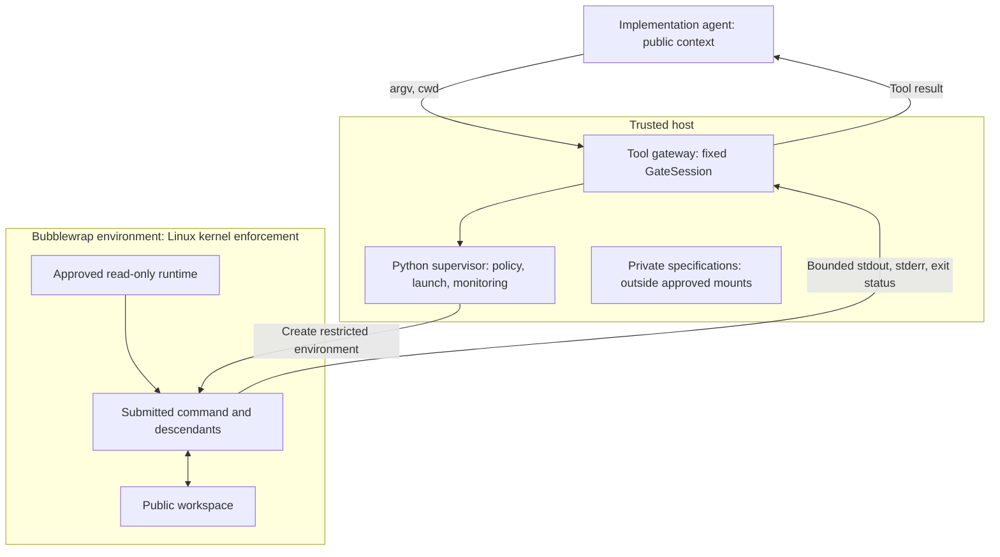

# How the current sandbox works

MirrorGate uses a trusted Python supervisor to launch submitted commands through
Bubblewrap. Bubblewrap constructs an isolated Linux environment, and the kernel
enforces its filesystem, process, network, and privilege boundaries. This document
explains the implemented `linux-bubblewrap-v1` backend. The
[backend guide](https://github.com/NzSN/MirrorGate/blob/main/docs/linux-bubblewrap.md) remains the reference for prerequisites,
exact limits, and operational caveats; the [architecture](https://github.com/NzSN/MirrorGate/blob/main/docs/architecture.md)
defines ownership across MirrorGate, the evaluator, and the agent host.

The implemented [managed host](agent-hosting-control-v2.md) owns fresh Codex
launch, configuration, tool mediation and cleanup, reusing this sandbox backend.
The lower-level command gateway described here runs restricted commands; its
callers may be the managed host, an external trusted host, or a human operator.
See [final validation](managed-workflow-validation.md) for actual runtime evidence.

## From an agent request to a restricted command



The model or agent controller can run elsewhere. Its resource-access tools run
through this boundary. MirrorGate does not automatically intercept an existing
agent's shell, file APIs, search tools, or connectors.

### 1. The host fixes configuration before accepting requests

The trusted host constructs `GateSession(TrustedConfig("authoring", workspace))`.
Configuration selects the workspace, profile, approved runtime mounts, and limits.
The [authoring-host example](https://github.com/NzSN/MirrorGate/blob/main/examples/authoring-host.py) accepts JSONL requests
on standard input, such as:

```json
{"argv":["/usr/bin/cat","src/main.rs"],"cwd":"."}
```

`ToolRequest.from_dict()` accepts only `argv` and `cwd`. It rejects unknown fields,
oversized arguments, and working directories that are absolute or contain `..`.
The agent cannot submit a new runtime mount or replace the profile. The command
arguments are passed as an argument vector; a shell runs only when explicitly
requested, and runs inside the same sandbox.

[policy.py](https://github.com/NzSN/MirrorGate/blob/main/supervisor/mirrorgate/policy.py) owns these checks.
`GateSession.__init__()` also checks Linux, a non-root controller, and an executable,
non-setuid Bubblewrap of a supported version. Unsupported configuration raises
`AdmissionError`. Namespace setup can still fail at launch; that produces a failed
command, with no retry as an unrestricted subprocess. An outer sandbox or host
namespace policy can therefore prevent an otherwise valid request from running.

### 2. The supervisor prepares the permitted filesystem

A mount makes a selected host directory visible at a path inside the sandbox.
Bubblewrap builds a separate filesystem view containing approved mounts and fresh
temporary filesystems, then makes the root mount read-only.

| Sandbox path | What the command sees |
| --- | --- |
| `/workspace` in authoring | Live public source tree, writable |
| `/source` in build | Frozen source copy, read-only |
| `/output` in build | Supervisor-selected build output, writable |
| `/artifact` in execution | Frozen artifact copy, read-only |
| `/usr` | Operator-approved host runtime tree, read-only |
| `/runtime/NAME` | Additional operator-approved runtime trees, read-only |
| `/tmp`, `/scratch`, `/dev/shm` | Fresh, size-limited temporary storage |
| `/proc` | Processes visible inside the sandbox PID namespace |
| `/dev` | Basic devices supplied by Bubblewrap |

For example, suppose the host has a public tree at `/srv/submission` and a private
specification at `/srv/evaluator/spec.tla`. Mounting the public tree at `/workspace`
does not expose `/srv/evaluator`. Even a command given the exact private pathname
cannot resolve it through this filesystem view. Walking upward from `/workspace`
reaches the sandbox root, not the parent of the host submission directory.

This protection depends on mount contents: a private specification copied into
the public workspace or an approved runtime tree becomes readable. Read-only
mounting protects against writes, not disclosure. The operator must approve `/usr`
and additional runtime trees as public and keep them outside agent mutation.

The supervisor opens directory descriptors to pin mount sources during launch.
It rejects overlapping runtime and writable roots and checks directory identities
for aliases. It does not reconstruct the host's entire bind-mount graph; the
operator must avoid writable aliases of runtime subtrees.

### 3. Bubblewrap restricts other access routes

A Linux namespace gives a process a separate view of a particular resource.
`GateSession.command()` configures separate user, PID, network, IPC, and UTS
namespaces alongside the filesystem setup. Consequently, the command has its own
process view, network stack, IPC namespace, and hostname. Networking is limited to
its private namespace; this backend exposes no host or external network service.

The launch also drops capabilities, disables nested user namespaces, and sets
`no_new_privs`. The inherited host environment is cleared and replaced with a
small fixed environment, including `HOME=/scratch/home`.

File descriptors need separate handling: an already-open host directory can remain
accessible even when its pathname is absent. The supervisor passes pinned directory
descriptors for mount setup, then runs a trusted `/usr/bin/python3 -I -S` bootstrap
inside the sandbox. That bootstrap closes descriptors above 2 before executing
the requested command. Only the standard input, output, and error transport remains.

See `GateSession.command()`, `_start()`, and `_child()` in
[sandbox.py](https://github.com/NzSN/MirrorGate/blob/main/supervisor/mirrorgate/sandbox.py) for the launch path.

### 4. The supervisor monitors each command

A launch helper sets hard and soft resource limits before executing Bubblewrap:
CPU time, virtual address space, UID-scoped process count, open descriptors, and
individual file size. Core dumps are disabled. `SandboxProcess._monitor()` drains
stdout/stderr, caps their total bytes, and enforces a wall-clock deadline.
Cancellation or exceeded bounds trigger process-group termination.

The submitted command runs as PID 1 in its PID namespace. When it dies, namespace
cleanup terminates remaining descendants, including descendants that start a new
process session. Parent-death handling connects the launcher's lifetime to the
supervisor. Closing a `GateSession` terminates active work, closes pinned
descriptors, and removes supervisor-owned snapshots.

Each request starts a fresh Bubblewrap process environment. A session permits one
active command at a time; authoring workspace edits persist through the host mount,
while private temporary storage and background processes do not persist into the
next command. Resource and output monitoring is per launched command, not a budget
accumulated over the whole authoring conversation.

Batch `run()` closes stdin after supplying input and lets the command finish within
its deadline. Streaming execution-channel EOF can instead trigger a short grace
period followed by forced cleanup. Worker protocol cancellation is a separate
layer above this process supervision; see [protocol v1](https://github.com/NzSN/MirrorGate/blob/main/docs/protocol-v1.md).

## Why build and runtime use restricted profiles

Development-tool isolation ends with the command it confines. A submission's
build script or compiler plugin can execute again during preparation; the SUT
and adapter execute during replay, including at import/initialization. Running
either stage on the evaluator host would reopen private file/environment access.
Gate therefore applies separate build and execution profiles around those runs.
The trusted evaluation integration retains the generated binding/proxy and
private model and supplies an implementation to generic MirrorECMA MBT; it does
not import the submitted adapter or put Gate lifecycle into MirrorECMA. See the
[three-stage access table](blind-validation.md#three-environments).

Profiles can be temporary environments on the same host. They do not require
three permanent machines, and no-compilation submissions may use minimal
preparation while retaining snapshot identity and restricted execution.

## Handoff from authoring to evaluation

Authoring scans its initial tree for unsupported files and retains the live
writable workspace. Build and execution copy their inputs into supervisor-owned
snapshots before launch. `freeze_tree()` in
[artifacts.py](https://github.com/NzSN/MirrorGate/blob/main/supervisor/mirrorgate/artifacts.py) uses descriptor-relative
traversal with `O_NOFOLLOW`, accepts directories and regular files with one link,
rejects symlinks and special files, and checks for changes during copying. It
hashes file contents and records relative paths and executable flags to identify
the snapshot.

The trusted controller selects build output for the next execution session, which
snapshots that artifact. This separates active evaluation from later authoring
edits. The controller must stop concurrent writers to obtain a coherent multi-file
submission; the copy checks do not implement an atomic transaction across a live
source tree. Artifact identity also does not establish that submitted code is honest.

## What the agent host must provide

These obligations apply to the implemented MirrorGate managed host and to
external hosts using the lower-level gateway. Managed-host admission requires a
fresh audit of the supported runtime; it does not restrict an already-running agent.

The gateway can restrict access to private specifications only when every
access-capable agent tool goes through it or an explicitly approved restricted
integration. An independent host shell, file reader, or connector capable of
reading the evaluator remains a bypass. The administrative CLI and session
configuration therefore belong to trusted code, not the agent's tool surface.

The host must also keep private specifications out of prompts, retrieved context,
and returned evaluation diagnostics. The example gateway returns command output;
it is not a general secret-redaction engine. Information deliberately supplied
through stdin, mounted files, or another permitted channel remains visible.
See [blind validation](https://github.com/NzSN/MirrorGate/blob/main/docs/blind-validation.md) for disclosure and observation-fidelity
requirements.

## Verification and current limits

The [authoring gateway test](https://github.com/NzSN/MirrorGate/blob/main/tests/test_authoring_host.py) checks that reading
a public file succeeds, reading a private specification outside the workspace
fails, and requests to add mounts or escape through `cwd` are rejected. The
[isolation tests](https://github.com/NzSN/MirrorGate/blob/main/tests/test_isolation.py) cover additional filesystem, process,
environment, descriptor, network, lifecycle, and resource cases. These are concrete
backend checks, not proof that an arbitrary agent host routes every tool correctly.

From the repository root, run the focused checks on a host that permits Bubblewrap:

```bash
PYTHONPATH=supervisor python3 -m unittest discover -s tests -p 'test_authoring_host.py' -v
PYTHONPATH=supervisor MIRRORGATE_REQUIRE_SANDBOX=1 python3 -m unittest discover -s tests -p 'test_isolation.py' -v
```

The full required-backend gate is `bash scripts/test.sh`. Unavailable namespaces
or skipped checks are not successful isolation evidence. See [tasks.md](https://github.com/NzSN/MirrorGate/blob/main/docs/tasks.md)
for recorded verification scope.

The current backend shares the host kernel and trusts Bubblewrap and approved
runtime trees. It adds no syscall seccomp allowlist and provides no aggregate
cgroup quotas. Virtual-address limits are not RSS limits, and UID process limits
are not sandbox-wide PID quotas. Abrupt supervisor termination can leave snapshot
directories behind; crash-recovery garbage collection is not implemented. Exact
operational restrictions remain in the [backend guide](https://github.com/NzSN/MirrorGate/blob/main/docs/linux-bubblewrap.md).
