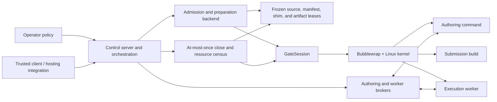

# MirrorGate supervisor design

Status: the Linux/Bubblewrap supervisor, control v1/v2 lifecycle, managed agent
host, filtered source views, source/build/artifact freezing, Node/Rust worker
admission, and bounded cleanup described here are implemented.

## Purpose

The supervisor is the trusted host process that turns operator policy and a
bounded control request into restricted authoring, build, and execution
environments. It is the only component that may choose host paths, construct
Bubblewrap mounts, hold snapshot leases, launch restricted processes, and decide
when their resources have been removed.

The supervisor does not interpret a TLA+ model, compare expected and actual
states, write the implementation, or decide which private result may be
published. Mirrors, the implementation agent, and the trusted evaluator retain
those responsibilities respectively.



The [architecture](../architecture.md) defines the system boundary. This document
defines the supervisor inside that boundary. The [sandbox walkthrough](design.md)
explains a single restricted command, while the
[orchestration contract](../orchestration-control-v1.md) defines public control
records and state transitions.

## Trust boundary

Trusted inputs are fixed before untrusted execution:

- an operator-owned policy catalog;
- the authenticated local principal and owning control connection;
- selected catalog IDs and tighter numeric limits;
- a validated public port manifest and model revision identity;
- an approved agent profile and immutable public task for managed authoring; and
- trusted evaluation authority supplied only after exact model negotiation.

Untrusted inputs include source files, authoring commands, submitted build hooks,
artifact initialization, adapter operations, SUT behavior, and arbitrary process
output. The supervisor validates their shape and bounds but does not trust their
meaning.

The control caller selects approved IDs. It cannot introduce a host path,
executable, runtime mount, credential file, sandbox backend, or looser limit.
The restricted agent receives only its session-bound public contract and
authoring tools. Private model material remains outside every admitted mount.

## Module ownership

| Module | Responsibility |
| --- | --- |
| `control_policy.py` | Strict operator catalog, approved roots, build/tool/runtime/agent profiles, and limit ceilings |
| `policy.py` | Low-level trusted sandbox configuration, mount separation, request validation, and resource limits |
| `control_protocol.py` | Closed control frames, operations, capabilities, IDs, bounds, and correlation validation |
| `control_server.py` | Stdio/Unix control serving and connection lifetime |
| `orchestration.py` | One authoritative session state machine, operation registry, authorization, cancellation, and cleanup join |
| `preparation.py` | Policy admission, source commitment, restricted build, artifact freezing, worker reservation, and backend resource census |
| `artifacts.py` | Descriptor-pinned snapshot copying, content manifests, hashes, owner-bound leases, and removal |
| `sandbox.py` | Bubblewrap command construction, namespace/mount/environment setup, process monitoring, termination, and per-command results |
| `worker_broker.py` | Private worker endpoint, one-use attachment, bounded relay, worker lifecycle validation, and teardown |
| `authoring_broker.py` / `authoring_mcp.py` | Session-bound public contract, approved tool execution, explicit submission, and bounded MCP transport |
| `agent_policy.py` / `agent_runtime.py` / `agent_audit.py` | Managed-agent profile validation, fresh process environment, dispatcher restrictions, identity audit, and agent cleanup |
| `cli.py` | Trusted administrative entry point; never an agent capability |

No SDK reimplements these transition or cleanup decisions. SDKs encode requests,
validate responses, and retain their owning connection.

## Managed lifetime

One owning session follows this order:

1. **Load policy.** Parse the complete closed catalog and pin approved root
   identities before serving requests.
2. **Open session.** Validate the principal, selected IDs, submission reference,
   public manifest, runtime, model revision, and tightened limits. Allocate the
   session-owned directory and freeze trusted manifest/shim inputs. No submitted
   code runs here.
3. **Author, when enabled.** Mount the selected live public source at writable
   `/workspace`. The managed host exposes only `public_contract`, approved
   `gate_exec`, and `submit`; an external host must provide an equivalent closed
   tool boundary.
4. **Commit source.** Explicit submission seals authoring, quiesces active tools,
   and freezes the source once. Duplicate submit observes the same commitment;
   it does not create another snapshot.
5. **Prepare.** Run the approved build plan with frozen source at read-only
   `/source` and a fresh supervisor-owned writable `/output`. Freeze the selected
   artifact and bind source, artifact, manifest, runtime, and policy identities.
6. **Negotiate.** The evaluator performs exact model-interface matching outside
   the worker. Only a bounded Gate authorization attestation crosses back.
7. **Acquire worker.** Reserve one owner-bound endpoint and one-use attachment,
   launch the approved runtime over read-only `/artifact`, and validate worker
   handshake and public-port traffic.
8. **Close.** Stop new operations, settle or cancel active work, close worker and
   author processes, release every lease and endpoint, close the owning client,
   and report cleanup independently of the model outcome.

Control v1 supports prepared/prebuilt evaluation. Control v2 adds managed agent
hosting and explicit source submission without changing the preparation or
worker authority ordering.

## Filesystem and process profiles

| Profile | Primary mount | Writable host-backed path | Untrusted code |
| --- | --- | --- | --- |
| Authoring | selected public source at `/workspace` | `/workspace` | development tools requested by the implementer |
| Build | frozen source at `/source` | fresh `/output` | submitted build hooks, compilers, and plugins |
| Execution | frozen artifact at `/artifact` | none | runtime shim, submitted adapter, and SUT |

Every profile receives private size-limited `/tmp`, `/scratch`, and `/dev/shm`.
Approved runtimes are read-only. The sandbox root is remounted read-only after
setup. The backend creates user, PID, IPC, network, and UTS namespaces, drops all
capabilities, disables nested user namespaces, sets `no_new_privs`, clears the
host environment, and closes inherited mount descriptors before executing the
requested command.

The supervisor passes argument vectors directly. A shell exists only when the
approved command explicitly launches one. There is no unrestricted fallback if
policy validation, namespace creation, or execution fails.

The exact Linux behavior, prerequisites, and limits are specified in the
[Linux/Bubblewrap profile](linux-bubblewrap.md). Other operating-system backends
must implement the same supervisor contract and publish their own enforcement
evidence; they cannot inherit Linux claims by interface compatibility.

## Source and artifact identity

An approved input is resolved beneath a pinned root using a canonical relative
path. Traversal rejects absolute paths, `..`, symlink components, non-directory
intermediate components, and changed root identities.

Snapshot copying accepts ordinary directories and single-link regular files.
It rejects symlinks, hard-linked regular files, devices, sockets, unsupported
names, excessive depth/count/bytes, and files that change while being copied.
Traversal opens components relative to pinned directory descriptors with
`O_NOFOLLOW`. The manifest records sorted relative paths, file sizes, content
hashes, kinds, and executable flags; its digest is the snapshot identity.

Source, artifact, public manifest, semantic interface, model revision, runtime,
policy, agent executable, and credential revision remain separate identities.
A matching source hash proves equal frozen source bytes under the implemented
snapshot algorithm. It does not prove correct behavior or absence of secrets in
the selected source.

Frozen leases are owner-bound and expose no host snapshot path through the
control protocol. Build and execution obtain duplicated descriptors only after
the same owner and lease are validated.

## Authoring and managed agents

The managed agent host launches a fresh audited agent environment with a fixed
profile, bounded output, a restricted environment, and only the session-bound
authoring MCP client. The application-specific public task is retrieved through
`public_contract`; it is not injected with the coordinator's conversation or
private evaluator state.

`gate_exec` maps a catalog tool ID and arguments to one restricted authoring
command. It does not expose arbitrary host process launch. `submit` is explicit
and terminal for the source commitment. Preparation revokes further authoring.
Agent completion prose is not submission.

The supervisor confines resource-accessing tools, not remote model inference as
an abstract service. A host that also gives the agent an unrestricted shell,
filesystem reader, search connector, or inherited project context invalidates
the blindness claim even if Gate commands themselves are isolated. See
[blind validation](blind-validation.md).

## Worker admission and relay

The worker does not receive the Mirrors protocol, private traces, expected
states, previous model states, or evaluator configuration. It receives a
sanitized public manifest, declared action inputs, observation requests, and
lifecycle messages over the worker protocol.

The supervisor reserves a private Unix endpoint only after preparation and
authorization. Attachment uses an owner-bound, expiring, one-use token. The
broker enforces frame bounds, increasing correlation IDs, single-flight
ordinary operations, cancellation ordering, handshake identities, and closing
rules while relaying frames without interpreting model semantics.

The runtime shim converts public worker values to the language-native adapter
port. Runtime-specific conversion belongs to the Node or Rust worker, not the
supervisor state machine.

## Cancellation and cleanup

Cancellation is a state transition, not proof of quiescence. The supervisor
records active authoring, build, preparation, agent, reservation, attachment,
worker, and snapshot resources under the owning session. Close seals new work,
requests cooperative shutdown where safe, escalates to process-group termination
within fixed budgets, joins background activity, releases leases, removes Unix
endpoints and owned directories, and reports remaining resources.

Model outcome and cleanup outcome remain separate. A model pass with failed or
unconfirmed cleanup is not an overall pass. A cleanup failure remains secondary
to an earlier model or application failure without being discarded.

Session operations and close paths use locks and idempotent terminal records so
late completions cannot acquire new authority. Exactly-once cleanup means one
authoritative transition and stable result; individual lower-level cleanup
attempts may be retried within their bounded owner-controlled close operation.

Abrupt supervisor termination can leave snapshot directories even though
Bubblewrap's parent-death and namespace behavior terminates restricted processes.
The implemented backend has no restart-durable resource ledger or garbage
collector. Operators must verify the controller has exited before removing a
retained directory.

## Errors and disclosure

Errors retain a stable family and stage: policy/admission, authoring, preparation,
build, authorization, worker attachment/protocol, application/model evaluation,
cancellation, timeout, or cleanup. Trusted receipts may retain bounded internal
details. Public results are closed allowlisted projections and never serialize
arbitrary exceptions, private paths, traces, expected values, credentials, or
control handles.

The supervisor cannot determine whether an apparently public behavior statement
reveals a private invariant. The trusted evaluator owns that content decision.
The supervisor guarantees only that unapproved files and trusted receipt fields
do not cross its defined channels.

## Filtered source views

Policy catalog v2 may attach `sourceView` to a source-only approved root. Its
closed `mirrorgate.source-view/v1` record contains a mode-`0700`, supervisor-owned
`workspaceRoot` and 1 to 1,024 exact `includePaths`. Each path selects one file or
one recursively copied directory. Version 1 deliberately has no glob, exclude,
negation, optional path, or mutable ignore-file syntax.

Before publishing a session, the supervisor creates exactly
`workspaceRoot/session-<sessionId>` and copies the selected view there through
pinned directory descriptors. It rejects linked or changing inputs, special
files, overlapping selections, selection/workspace overlap, destination
collisions, and count, byte, depth, or path overflow. Shared implicit ancestors
such as `a/x` and `a/y` are materialized once. Omitted repository entries are not
scanned or charged against view limits.

The materialized directory becomes the only `/workspace` and later source-freeze
input. The original repository and omitted `.git`, dependency, or
`.mirrors/private` paths are never mounted. Authoring changes affect only the
view. A successfully committed or prepared authoring view remains under the
operator workspace root for trusted promotion. Failed or unsubmitted authoring
views and all no-author views are removed during cleanup. Removal failures remain
owned and are retried by session or backend cleanup as `source-view` resources.

The selector, initial selected manifest, and final frozen source receive separate
digests. Filtered `sourceHash` is a domain-separated hash of the approved-root ID,
selector digest, selected-manifest digest, and ordinary final source-snapshot
digest. The active backend session retains the corresponding
`mirrorgate.source-view-receipt/v1` until cleanup; version 1 has no detailed
post-cleanup receipt registry. Hosted submission and preparation return the same
effective source hash. Unfiltered roots retain their existing source hashes
byte for byte.

The client request remains `submission.input: {rootId, relativePath}`. Selection
rules and host paths remain operator policy. Existing control records, Node/C++
SDKs, worker protocol, and runtime manifests are unchanged. Hello advertises
`submission.source-view-v1` when any loaded policy provides the feature.

See the [implementation plan and acceptance record](source-views-plan.md) for the
hash formulas, failure rules, ownership, and exact test commands.

## Validation and change rules

Run the repository aggregate for supervisor, policy, protocol, runtime, or
sandbox changes:

```bash
cargo fetch --manifest-path runtimes/rust/Cargo.toml --locked
bash scripts/build.sh
bash scripts/test.sh
```

Isolation changes require actual `MIRRORGATE_REQUIRE_SANDBOX=1` Bubblewrap tests.
Cover allowed access and attempted escape through paths, symlinks, descriptors,
environment, processes, network, output limits, cancellation, partial startup,
EOF, and cleanup. A denied or unavailable backend is not a passing isolation
test.

Update this document, the applicable policy/backend document, compatibility
claims, and conformance fixtures together. Keep proposed behavior explicitly
separate from implemented behavior and record exact tool versions and skipped
tiers with the resulting evidence.
